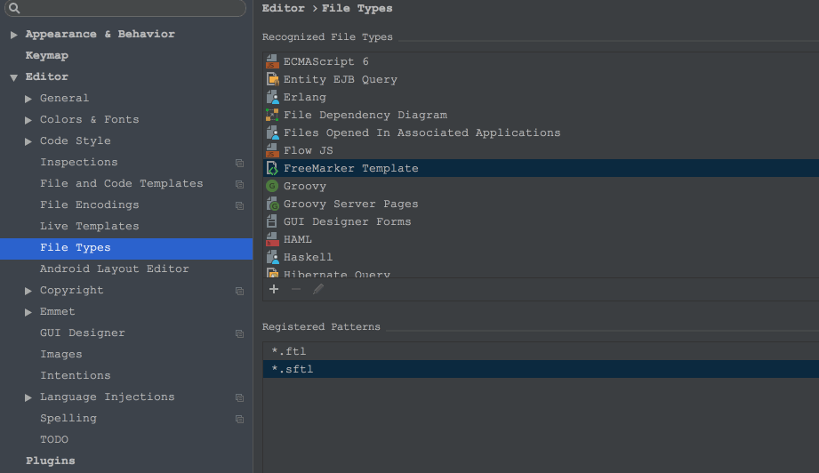
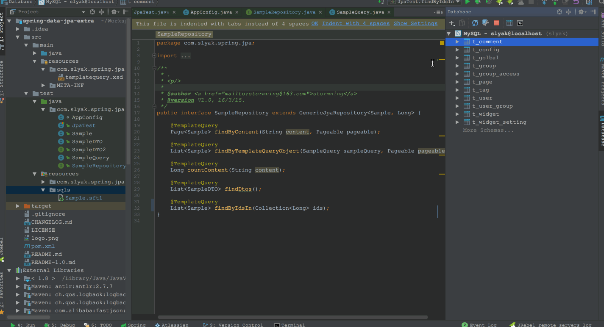

# spring-data-jpa-extra

## use spring data jpa more comfortable
I love spring-data-jpa, she set my hands free, crud methods are boring! However she is not perfect on dynamic native query and her return type must be an entity, although she provide us a specification solution, but i think it's heavy and not easy to use.

<b>spring-data-jpa-extra comes to solve three problem:</b>

- dynamic native query support like mybatis
- return type can be anything
- no code, just sql

## Example
- first add ComponentScan

by java bean
```java
@ComponentScan({"com.slyak","your.base.package"})
```

by xml
```xml
<context:component-scan base-package="com.slyak,your.base.package"/>
```


- second extends GenericJpaRepository insteadof JpaRepository

```java
	public interface SampleRepository extends GenericJpaRepository<Sample, Long> {
		@TemplateQuery
		Page<Sample> findByContent(String content, Pageable pageable);
		@TemplateQuery
		CustomVO findCustomVO(Long id);
	}
```

- third create a file named Sample.sftl in your classpath:/sqls/ (you can change this path by setting placeholder <font color="#008B8B">spring.jpa.template-location</font>)

- In version 2.0.0.RELEASE , new template 'sftl' take place of xml (xml is complex, but it is also supported).
sftl is a ftl template mixed with sqls. The template will be simplified as below. It can be recognized in Intellij IDEA , follow these steps:
settings->Editor->File Types , find "Freemarker Template" and register a new type named '*.sftl',choose it's 'Template Data Language' such as 'MYSQL'.




```sql
--findByContent
SELECT * FROM t_sample WHERE 1=1
<#if content??>
AND content LIKE :content
</#if>

--findCustomVO
SELECT id,name as viewName FROM t_sample WHERE id=:id
```

## How to use?

you can use it by using source code or adding a maven dependency

```xml
    <dependency>
        <groupId>com.slyak</groupId>
        <artifactId>spring-data-jpa-extra</artifactId>
        <version>2.0.3.RELEASE</version>
    </dependency>
```
config with annotation
```java
@EnableJpaRepositories(basePackages = "your.packages", repositoryBaseClass = GenericJpaRepositoryImpl.class, repositoryFactoryBeanClass = GenericJpaRepositoryFactoryBean.class)
```

or with xml
```xml
<jpa:repositories base-package="your.packages" repository-base-class="com.slyak.spring.jpa.GenericJpaRepositoryImpl" repository-factory-bean-class="com.slyak.spring.jpa.GenericJpaRepositoryFactoryBean"/>
```

## 2 Miniute Tutorial

### Template Query
Methods annotated with @TemplateQuery tells QueryLookupStrategy to look up query by content,this is often used by dynamic query.

### Template Query Object
Object annotated with @TemplateQueryObject tells content process engine render params provided by object properties.

### Entity Assemblers
Entity assemblers can assembler entity with other entities, such as one to many relation or one to one relation.


### More Useful Methods (eg: mget togglestatus fakedelete)

```java
    //batch get items and put the result into a map
    Map<ID, T> mget(Collection<ID> ids);
    
    //get items one by one for cache
    Map<ID, T> mgetOneByOne(Collection<ID> ids);
    
    //get items one by one for cache
    List<T> findAllOneByOne(Collection<ID> ids);
    
    //toggle entity status if it has a Status property
    void toggleStatus(ID id);
    
    //set entity status to Status.DELETED if it has a Status property
    void fakeDelete(ID... id);
```


## TODO List
- More types of content support (now freemarker)
- More JPA comparison support (now hibernate)
- Performance test and do some optimization
- More other useful features
- Change to the latest spring-data-jpa version

## Change Log
[CHANGELOG](./CHANGELOG.md)

## How to use in old version ( <2.0 )
<a href="./README-1.0.md">old version guide</a>
